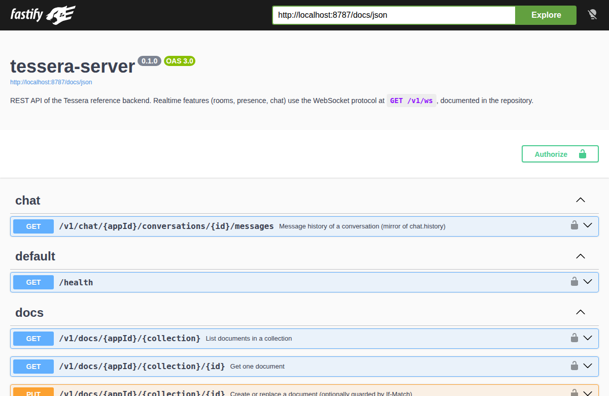
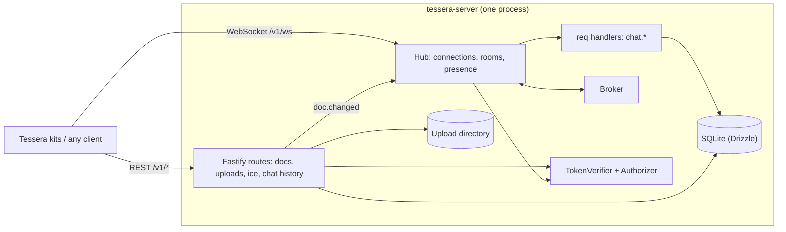

<h1 align="center">tessera-server</h1>

<p align="center"><b>Self-hostable realtime and storage backend for Tessera kits:</b> WebSocket rooms, chat, a document store, uploads and ICE/TURN credentials, with your own authentication. Part of the <a href="https://github.com/thakurabhishek7283/tessera">Tessera</a> kit family.</p>

<p align="center">
  <a href="https://github.com/thakurabhishek7283/tessera-server/actions/workflows/ci.yml"></a>
  <a href="LICENSE"></a>
  · Run it locally with <code>docker compose up</code>, interactive API docs at <code>/docs</code>
</p>

<p align="center"></p>

## Why

The Tessera kits (chat, video calls, kanban, comments, …) work in a browser tab with no backend at all. This server is what you add when they should work between people: it relays realtime messages, stores documents and chat history, accepts uploads and hands out TURN credentials. It does not own your users. You keep your identity provider, and the server only checks the tokens it issues. It runs from a single SQLite file, so there is nothing else to install.

## Features

- **Rooms.** WebSocket hub with `join`/`leave`, presence (shallow-merged JSON per peer), broadcasts, direct messages, per-room-kind limits (call rooms are capped at 6 by default) and a `Broker` seam for fan-out.
- **Chat.** Room and direct conversations, idempotent sends, keyset-paginated history (also over REST), edit, delete (author or moderator), reactions, read markers with unread counts.
- **Document store.** Versioned JSON documents per app and collection with optimistic concurrency (`If-Match`), equality filters, ordering and paging. Writes are announced to `docs:<collection>` rooms so clients refetch.
- **Uploads.** Multipart upload with a size cap, content-based type detection (the client's Content-Type is not trusted), image dimensions, random file names and immutable caching.
- **Calls.** STUN list plus coturn-style time-limited TURN credentials.
- **Bring your own auth.** `dev` (guests), `secret` (shared HS256 secret) or `jwks` (Auth0, Clerk, Keycloak, …), with configurable claim names and an optional per-token app allowlist.
- **Operable.** OpenAPI at `/docs`, structured logs with secrets redacted, rate limits, Docker image that runs as a non-root user on a read-only filesystem, graceful shutdown (sockets get close code 1001).

## Quick start

### Docker

```bash
git clone https://github.com/thakurabhishek7283/tessera-server.git
cd tessera-server
docker compose up --build
curl http://localhost:8787/health
```

Data (SQLite database and uploads) lives in the `tessera-data` volume. Copy [`.env.example`](.env.example) to `.env` to change settings.

### From source

Needs Node 22+, pnpm 10 and git.

```bash
pnpm deps      # clones and builds @tessera-kit/protocol into ./external
pnpm install
pnpm dev       # http://localhost:8787, docs at /docs
```

### Try it

Dev mode (`AUTH_MODE=dev`, the default) can mint guest tokens, so you can use everything without an identity provider:

```bash
TOKEN=$(curl -s -X POST localhost:8787/v1/auth/guest \
  -H 'content-type: application/json' -d '{"name":"Ada"}' | node -pe 'JSON.parse(require("fs").readFileSync(0)).token')

# store a document
curl -s -X PUT localhost:8787/v1/docs/demo/kanban.cards/card-1 \
  -H "authorization: Bearer $TOKEN" -H 'content-type: application/json' \
  -d '{"data":{"title":"Write docs","column":"todo"}}'

# list with a filter (-g stops curl from treating [] as a glob)
curl -sg 'localhost:8787/v1/docs/demo/kanban.cards?where[column]=todo' \
  -H "authorization: Bearer $TOKEN"
```

Chat over the WebSocket protocol (Node 22 has a global `WebSocket`):

```js
// chat.mjs — run with: node chat.mjs "$TOKEN"
const ws = new WebSocket('ws://localhost:8787/v1/ws');
const send = (m) => ws.send(JSON.stringify(m));
ws.onopen = () => send({ t: 'hello', v: 1, token: process.argv[2], appId: 'demo' });
ws.onmessage = ({ data }) => {
  const m = JSON.parse(data);
  console.log(m);
  if (m.t === 'welcome') send({ t: 'join', id: 'j1', room: 'demo/chat:general' });
  if (m.t === 'joined') {
    send({ t: 'req', id: 'r1', room: 'demo/chat:general', topic: 'chat.send',
      data: { conversationId: 'general', clientId: 'c1', body: { type: 'text', text: 'hello' } } });
  }
  if (m.t === 'res') ws.close();
};
```

### With the Tessera kits

Point the core adapters at the server. The `appId` you give the kits is the namespace on the server.

```js
import { createTessera } from '@tessera-kit/core';
import { createStorage, createUploads } from '@tessera-kit/storage';
import { createTransport } from '@tessera-kit/transport';

const tessera = createTessera(
  {
    appId: 'my-app',
    auth: { type: 'static', user: { id: 'u1', name: 'Ada' }, token: myJwt },
    transport: { type: 'websocket', url: 'wss://api.example.com/v1/ws' },
    storage: { type: 'rest', baseUrl: 'https://api.example.com' },
    uploads: { type: 'rest', baseUrl: 'https://api.example.com' },
    features: { chat: { enabled: true }, kanban: { enabled: true } },
  },
  {
    plugins: { /* feature loaders from the kit packages */ },
    adapters: { transport: createTransport, storage: createStorage, uploads: createUploads },
  },
);
```

## Configuration

All settings are environment variables, validated at boot; a bad value stops the server with a message that lists every problem. [`.env.example`](.env.example) has the same list with comments.

| Variable | Default | Description |
| --- | --- | --- |
| `PORT` | `8787` | Listen port. |
| `HOST` | `0.0.0.0` | Listen address. |
| `PUBLIC_URL` | `http://localhost:8787` | Public base URL, used for upload links in responses. |
| `DATABASE_PATH` | `./data/tessera.db` | SQLite file (created, with migrations applied, on start). |
| `CORS_ORIGINS` | `http://localhost:5173` | Comma-separated browser origins. `*` is accepted only with `AUTH_MODE=dev`. |
| `AUTH_MODE` | `dev` | `dev`, `secret` or `jwks`. See [Use with your own auth](#use-with-your-own-auth). |
| `JWT_SECRET` | `change-me` | HS256 secret for `dev` and `secret`; at least 32 characters in `secret` mode. |
| `JWKS_URL` | – | Key set URL, required for `jwks` (RS256/ES256 only). |
| `JWT_ISSUER`, `JWT_AUDIENCE` | – | Optional claim checks. |
| `JWT_CLAIM_USER_ID` | `sub` | Claim holding the user id. |
| `JWT_CLAIM_NAME` | `name` | Claim holding the display name (falls back to the id). |
| `JWT_CLAIM_AVATAR` | `picture` | Claim holding the avatar URL. |
| `JWT_CLAIM_ROLES` | `roles` | Claim holding role names (`moderator` may delete anyone's messages). |
| `JWT_CLAIM_APPS` | `tessera_apps` | Optional claim listing the app ids a token may use. Absent means any app. |
| `UPLOAD_DIR` | `./data/uploads` | Where uploaded files are stored. |
| `UPLOAD_MAX_BYTES` | `5242880` | Per-file size limit. |
| `UPLOAD_ALLOWED` | `image/png,image/jpeg,image/webp,image/gif,application/pdf` | Allowed types, matched against the detected type; `image/*` style wildcards work. |
| `CALL_MAX_PARTICIPANTS` | `6` | Capacity of `call:*` rooms. |
| `STUN_URLS` | `stun:stun.l.google.com:19302` | Comma-separated STUN servers returned by `/v1/ice`. |
| `TURN_URLS`, `TURN_SECRET` | – | Enable TURN: the secret is shared with coturn (`use-auth-secret`). |
| `TURN_TTL_SECONDS` | `3600` | Lifetime of TURN credentials. |
| `ENABLE_DOCS` | `true` | Serve the interactive API docs at `/docs`. |
| `RATE_LIMIT_PER_MINUTE` | `300` | REST requests per client IP per minute (`/health` is exempt). |
| `LOG_LEVEL` | `info` | `fatal` … `trace`, or `silent`. |

### Optional TURN server

```bash
# .env
TURN_SECRET=<long random string>
TURN_URLS=turn:turn.example.com:3478
docker compose --profile turn up
```

The `turn` profile runs coturn with `use-auth-secret`, so credentials from `/v1/ice` are verified without a user database and expire on their own. Behind NAT add `--external-ip=<public ip>` to the `command` in `docker-compose.yml`.

## HTTP API

Everything is JSON under `/v1`; errors always look like `{ "error": { "code", "message", "details?" } }`. Request and response schemas are the zod definitions in [`@tessera-kit/protocol`](https://github.com/thakurabhishek7283/tessera/tree/main/packages/protocol), and `/docs` is generated from them.

| Method and path | Auth | Description |
| --- | --- | --- |
| `GET /health` | none | `{ ok, version, uptime }` |
| `POST /v1/auth/guest` | none, `dev` only | `{ name }` → `{ token, user }`, valid 24 h |
| `GET /v1/ice` | user | `{ iceServers }`: STUN, plus TURN with credentials for the caller |
| `GET /v1/docs/:appId/:collection` | read | Filters `where[field]=value`, `orderBy`, `dir`, `limit` (≤ 200), `cursor` |
| `GET /v1/docs/:appId/:collection/:id` | read | One document; `ETag` is its version |
| `PUT /v1/docs/:appId/:collection/:id` | write | Body `{ data }`. `If-Match: <version>` makes it conditional (`0` = create only); a mismatch is `409` with the current copy in `current` |
| `DELETE /v1/docs/:appId/:collection/:id` | write | Soft delete; optional `If-Match` |
| `POST /v1/uploads/:appId` | write | Multipart field `file` → `{ id, url, mime, size, width?, height? }` |
| `GET /uploads/:file` | none | Stored file, `immutable` caching, non-images download as attachments |
| `GET /v1/chat/:appId/conversations/:id/messages` | read | REST mirror of `chat.history` (`before`, `after`, `limit`) |

Notes on the document store: `where` compares top-level fields for equality (`where[rank]=2` matches the number 2 and the string `"2"`, `where[x]=null` matches a missing or null field); `cursor` is opaque; collection names are namespaced by kits (for example `kanban.cards`).

## WebSocket protocol

`GET /v1/ws`. Frames are JSON text, at most 64 KiB, validated on both sides with the schemas in `@tessera-kit/protocol`. Room names are `<appId>/<kind>:<id>`; a connection can only join rooms of the `appId` it said hello with.

| Client sends | Server answers or sends |
| --- | --- |
| `hello { v:1, token, appId }` (first frame, within 5 s) | `welcome { peerId, user, serverTime }`, or an error and close |
| `join { id, room, presence? }` | `joined { id, room, peers }` and `peer-join` to the others; failure is `error { ref: id }` |
| `leave { room }` | `peer-leave` to the others |
| `presence { room, patch }` (≤ 2 KB) | `presence { peerId, patch }` to the others |
| `pub { room, topic, data }` | `msg { from: peerId, … }` to the others |
| `direct { room, to, topic, data }` | `msg` to `to` only |
| `req { id, room, topic, data }` | `res { id, ok, data \| error }` |
| `ping { ts }` | `pong { ts, serverTime }` |

Requests (`req`) available on the server:

| Topic | Purpose |
| --- | --- |
| `chat.conversations` | Room and direct conversations with last message and unread count |
| `chat.open-direct` | Find or create the direct conversation with another user |
| `chat.send` | Send a message; retries with the same `clientId` return the stored message |
| `chat.history` | Page through messages (`before`/`after` keyset cursors) |
| `chat.edit`, `chat.delete` | Author only; moderators may also delete |
| `chat.react` | Add or remove a reaction |
| `chat.read` | Move the read marker forward |

Server broadcasts (`from: "server"`): `chat.message`, `chat.message-updated`, `chat.reaction`, `chat.read` to the room `chat:<conversationId>`, and `doc.changed` to `docs:<collection>`. Clients cannot publish these topics.

Close codes: `4001` no hello in time, `4003` authentication failed or app not allowed, `4008` protocol violation (first frame not hello, too many invalid frames), `1009` frame too large, `1001` server shutting down. Each connection has a token bucket (40 frames, refilling 20 per second) and `chat.send` is limited to 5 per second per user; excess frames get a `RATE_LIMITED` error and are dropped.

Direct conversations live in rooms named `chat:dm:<hash>`, and only their two members can join them. Clients find new direct conversations through `chat.conversations`; there is no push for "someone started a conversation with you".

## Use with your own auth

The server never stores credentials. It verifies a bearer token (REST `Authorization` header, or the `token` in the WebSocket `hello`) and reads the user from its claims. Pick a mode with `AUTH_MODE`:

**`secret`: your backend signs tokens.** Share one secret between your backend and this server.

```js
import { SignJWT } from 'jose';

const token = await new SignJWT({ name: user.name, picture: user.avatarUrl, roles: ['moderator'] })
  .setProtectedHeader({ alg: 'HS256' })
  .setSubject(user.id)
  .setExpirationTime('1h') // exp is required outside dev mode
  .sign(new TextEncoder().encode(process.env.JWT_SECRET));
```

```bash
AUTH_MODE=secret
JWT_SECRET=<at least 32 random characters>
CORS_ORIGINS=https://app.example.com
```

**`jwks`: an identity provider signs tokens.** Works with anything that publishes a key set.

```bash
AUTH_MODE=jwks
JWKS_URL=https://your-tenant.eu.auth0.com/.well-known/jwks.json
JWT_ISSUER=https://your-tenant.eu.auth0.com/
JWT_AUDIENCE=https://api.example.com
```

Only RS256 and ES256 are accepted in this mode, so a token cannot be checked against a public key used as a shared secret.

**Mapping claims.** If your tokens call things differently, set `JWT_CLAIM_USER_ID`, `JWT_CLAIM_NAME`, `JWT_CLAIM_AVATAR` and `JWT_CLAIM_ROLES`. To confine a token to certain apps, put their ids in the claim named by `JWT_CLAIM_APPS` (for example `"tessera_apps": ["shop"]`); without that claim a token may use any app id.

**`dev`: guests, for local work.** A connection without a token becomes an anonymous guest, and `POST /v1/auth/guest` mints tokens. Never expose this mode publicly.

**Custom rules in code.** Both seams are plain interfaces. To accept an unusual token format or change who may read or write what, implement `TokenVerifier` and `Authorizer` (see [`src/auth`](src/auth)) and pass them to `buildApp`:

```ts
// src/main.ts in your fork
import { buildApp } from './app.js';
import { AppError } from './lib/errors.js';
import { createAuthorizer } from './auth/policy.js';
import { openDatabase } from './db/client.js';
import { parseEnv } from './env.js';

const env = parseEnv();
const db = openDatabase(env.databasePath);
const app = await buildApp({
  env,
  db,
  // Return an AuthUser, or throw AppError('UNAUTHORIZED', …) to reject.
  verifier: {
    async verify(token) {
      const session = token ? await lookUpSession(token) : null;
      if (!session) throw new AppError('UNAUTHORIZED', 'Unknown session');
      return { id: session.userId, name: session.name, roles: session.roles, anonymous: false, apps: null };
    },
  },
  authorizer: {
    ...createAuthorizer(env, db),
    canWrite: (user, appId, collection) => user.roles?.includes('editor') ?? false,
  },
});
await app.listen({ port: env.port, host: env.host });
```

## Architecture



REST routes and the hub share one process, one database and one authorizer. Writes through REST are announced to subscribed sockets as `doc.changed`; the hub fans every room message out through a `Broker`, which is the extension point for running several instances. More in [docs/architecture.md](docs/architecture.md), with the reasoning behind the main choices in [docs/decisions](docs/decisions).

## Deploying

- Put a reverse proxy in front for TLS and forward WebSocket upgrades. The server trusts `X-Forwarded-*` for client addresses (rate limiting), so do not expose it directly to the internet without a proxy that sets them.
- Set `PUBLIC_URL` to the address clients reach, `CORS_ORIGINS` to your web app origin(s), and use `secret` or `jwks` mode.
- Back up by copying the data volume while the server is stopped, or with `sqlite3 tessera.db ".backup backup.db"` while it runs; keep the upload directory with it.
- One instance only for now: room membership and presence are held in memory. See the roadmap.

## Development

```bash
pnpm deps       # clone and build @tessera-kit/protocol (links ../tessera if it exists)
pnpm install
pnpm dev        # reload on change
pnpm check      # lint, typecheck, tests, build: the same as CI
```

Tests run against in-memory SQLite and a real WebSocket server. `test/interop.test.ts` also drives the real `@tessera-kit/transport` and `@tessera-kit/storage` clients against the server. See [CONTRIBUTING.md](CONTRIBUTING.md).

## Roadmap

- [x] REST document store with versions, filters and live change notifications
- [x] WebSocket hub: rooms, presence, direct messages, rate limits, heartbeat
- [x] Chat: history, edits, deletes, reactions, read markers, direct conversations
- [x] Uploads with content sniffing, ICE/TURN credentials, OpenAPI, Docker, graceful shutdown
- [ ] Redis (or NATS) `Broker` for running several instances
- [ ] Postgres option for the document store and chat
- [ ] S3-compatible upload storage
- [ ] Push notification when a direct conversation is opened

## Licence

MIT © Abhishek Thakur
