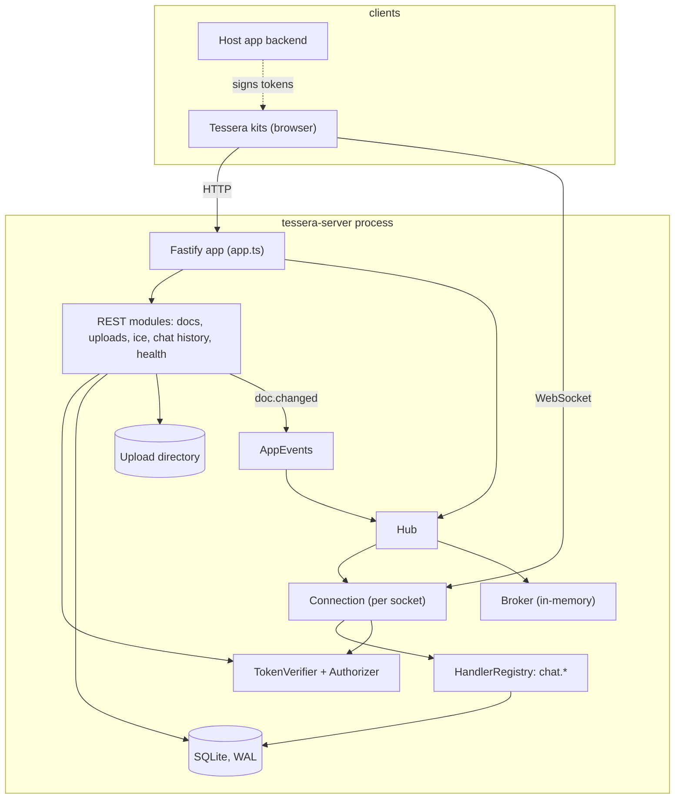
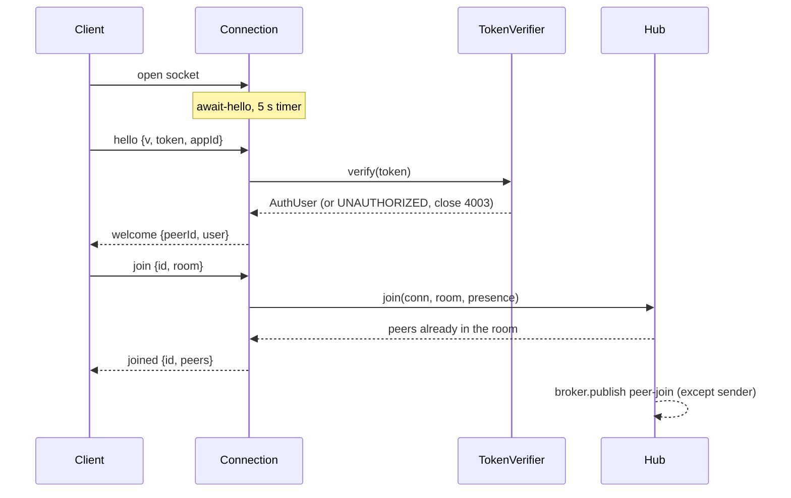
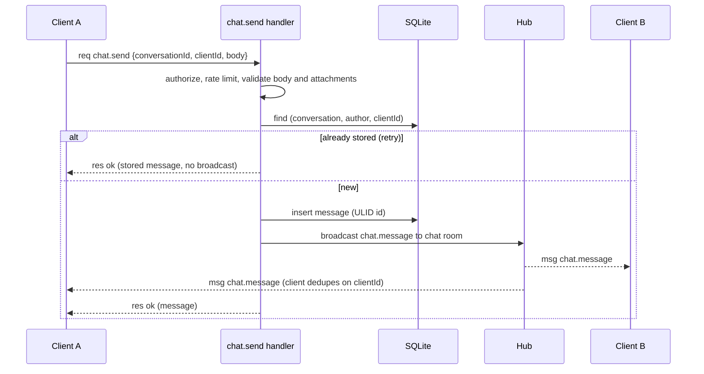

# Architecture

tessera-server is one Node process: a Fastify HTTP server with a WebSocket hub attached, one SQLite
database and one directory for uploaded files. Everything the Tessera kits need from a backend goes
through it: realtime rooms, chat, a document store, uploads and call credentials.

## Layout

| Path | Responsibility |
| --- | --- |
| `src/main.ts` | Boot: parse env, build the app, listen, shut down on SIGTERM/SIGINT |
| `src/app.ts` | `buildApp(options)`: wires plugins, error envelope, auth, hub and modules. The only place that knows about everything; tests call it directly |
| `src/env.ts` | zod-validated configuration, one typed `Env` object |
| `src/db/` | Drizzle schema, generated SQL migrations, SQLite client (WAL, foreign keys, migrate on open) |
| `src/auth/` | `TokenVerifier` implementations (dev, secret, JWKS), `Authorizer`, the guest-token route |
| `src/hub/` | Connection state machine, rooms and presence, `Broker`, request handler registry |
| `src/modules/docs` | Versioned JSON document store (repo + REST routes) |
| `src/modules/chat` | Chat persistence, access rules and the `chat.*` handlers, REST history mirror |
| `src/modules/uploads` | Multipart upload, content sniffing, disk storage, static serving |
| `src/modules/ice` | STUN list and time-limited TURN credentials |
| `src/lib/` | Error codes, id/clock injection, rate limiting, query parsing, JSON helpers |

Modules never import each other. They meet in `app.ts`, and talk through three small seams:
`AppEvents` (REST announces a document change, the hub listens), the hub's handler registry (chat
registers `chat.*`), and the `Authorizer` (every module asks it before touching data).

## Request lifecycles

### WebSocket connection

A connection moves through `await-hello`, `ready` and `closed`. Frames are queued and handled in
arrival order, so a `join` sent right behind `hello` cannot overtake token verification. `req`
frames are the one exception after the handshake: they run without blocking the queue, so a slow
handler does not delay pings or presence updates.

Every frame is size-checked, taken from a per-connection token bucket, parsed and validated with
`ClientMsg` from `@tessera-kit/protocol` before anything else sees it. Ten invalid frames in a minute
close the connection with 4008. The server pings with ws control frames and terminates peers that
do not answer.

### Chat message

The unique key `(conversation, author, clientId)` is what makes retries safe: a client that never saw
the response can resend and gets the original message back.

### Document write with live notification

`PUT /v1/docs/:appId/:collection/:id` authenticates, authorises (`canWrite`), then runs a single
transaction: read the current row, check `If-Match`, write version + 1. On success the route emits
`doc.changed` on `AppEvents`; the hub forwards it to the room `<appId>/docs:<collection>`. A stale
`If-Match` answers `409` with the stored document in `current`, so the client can rebase without
another request. Deletes are soft: the row keeps its version, so a re-created document never
reuses an old version number.

## Data model

SQLite through Drizzle; migrations are generated SQL in `src/db/migrations` and applied on open.

| Table | Purpose |
| --- | --- |
| `documents` | `(app_id, collection, id)` → JSON `data`, `version`, `updated_at`, `updated_by`, soft-delete flag |
| `conversations`, `conversation_members` | Room and direct conversations; members are recorded for direct ones only |
| `messages` | ULID id, author snapshot (id, name, avatar), JSON body and attachments, `reply_to`, edit and delete timestamps, unique `(conversation_id, author_id, client_id)` |
| `message_reactions` | `(message_id, user_id, emoji)` |
| `read_markers` | Latest read message id per `(conversation, user)` |
| `uploads` | Metadata of stored files (owner, type, size, dimensions, file name) |

The server treats document `data` as opaque JSON: kits own their schemas and validate on the client.
`where` filters are equality checks on top-level fields via `json_extract`, with field names
restricted to `[A-Za-z0-9_]{1,40}` so they are safe to embed in a JSON path. Everything else is a
bound parameter.

Conversations are stored under an app-scoped key (`<appId>/<id>`); clients only ever see the part
after the slash. See [ADR 0005](decisions/0005-app-scoped-conversation-keys.md).

## Authentication and authorization

`TokenVerifier.verify(token | null)` turns a bearer token into an `AuthUser` or throws
`UNAUTHORIZED`. Three implementations ship: `dev` and `secret` (HS256, via `jose`) and `jwks`
(remote key set, RS256/ES256 only). Claims are mapped with configurable names, `exp` is required
outside dev mode, and a token may carry an allowlist of app ids.

`Authorizer` answers four questions: may this user use this app, join this room, read or write this
collection. The default implementation is deliberately small: app allowlist, direct-message rooms
open to their members only, docs rooms following the collection's read rule, and anonymous users
limited to dev mode. REST and WebSocket paths call the same instance, so a rule written once applies
everywhere.

## Security notes

| Concern | Approach |
| --- | --- |
| Input | zod validation on every REST and WebSocket input; SQL only through Drizzle or bound parameters |
| Forged messages | Clients cannot publish or send the topics the server emits (`chat.*` events, `doc.changed`); `from` is always set by the server |
| Cross-app access | A socket can only join rooms of the app it said hello with; messages and conversations are looked up per app |
| Private conversations | Direct conversations are visible only to members: history, send, edit, react, read and room join all check membership and answer `NOT_FOUND` otherwise |
| Attachments | `chat.send` accepts only the caller's own uploads and takes URL, type and size from the stored upload, not from the client |
| Uploads | Size limit while streaming; type detected from content (the declared type is only a claim and must agree); random file names; `nosniff`; non-images served as downloads |
| Tokens | `exp` required outside dev; algorithm pinned per mode; never logged (Authorization header redacted) |
| Abuse | REST rate limit per IP, per-connection frame bucket, per-user `chat.send` limit, frame and presence size caps, room and participant caps |
| Transport | Helmet headers, CORS allowlist; TLS is expected from a reverse proxy |
| Container | Non-root user, read-only root filesystem with `/data` writable, no capabilities in the compose file |

## Scaling and limits

This is a single-instance server, and says so rather than pretending otherwise.

- **Broker.** All room fan-out goes through `Broker.publish/subscribe`. The in-memory implementation
  keeps one process correct. A Redis or NATS broker that republishes frames between instances would
  make room messages and `doc.changed` cross instances; two hubs sharing a broker are covered by a
  test.
- **Not replicated.** Peer lists, presence and the per-user chat rate limits live in each process, so a
  second instance would see only its own peers in `joined`. A real multi-instance deployment needs
  shared presence as well.
- **SQLite.** WAL mode gives many readers and one writer, which fits chat and kanban traffic of a
  small deployment. Moving to Postgres means a new Drizzle dialect and migrations; the repositories
  are the only code that touches the database.
- **Paging.** Document lists use opaque offset cursors; chat history uses keyset cursors on the ULID.
- **Direct conversation discovery.** A user learns about a new direct conversation by listing
  conversations; there is no push for it yet.

## Testing

Vitest, with the app built through `buildApp` and an in-memory database:

- REST routes via `fastify.inject`.
- Hub and chat through a real `ws` client on an ephemeral port (`test/ws.ts`), including heartbeat,
  rate limits, shutdown and close codes.
- JWKS with a local HTTP key server; ICE credentials against an independent HMAC vector.
- `test/interop.test.ts` runs the real `@tessera-kit/transport` and `@tessera-kit/storage` clients against
  the server, so protocol drift shows up here first.
- Time and ids are injectable (`Clock`, `Ids`) where determinism matters.

## Extension points

| Seam | How to use it |
| --- | --- |
| `TokenVerifier` | Accept any token format: pass `verifier` to `buildApp` |
| `Authorizer` | Change who may join, read and write: pass `authorizer` to `buildApp` |
| `HandlerRegistry` | `hub.handlers.define(topic, zodSchema, handler)` adds a request topic |
| `Broker` | Pass `broker` to `buildApp` to fan room traffic out across processes |
| `UploadStorage` | Implement `save(name, data)` for object storage instead of local disk |
